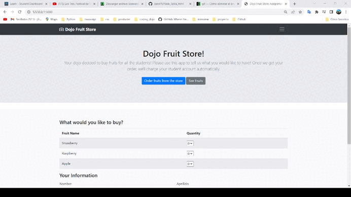

#   Flask: Tienda de frutas

## Contenido

    Proyecto practica de formulario que envia los datos a traves de  metodo de 
    post hacia el servidor y que simula una tienda de frutas, se reconoce la 
    importancia de redigir una pagina de un post y no renderizarla para no volver
    a reenviar los datos al actualizar la pagina.

  

## **Instalacion y configuracion**

#### Instalar un entorno virtual con  pipenv en forma global (omitir si ya está instalado):      
#### Window:
    pip install pipenv

#### Mac:
    pip3 install pipenv

#### Clona el repositorio del proyecto: 

    $ git clone https://github.com/JairoFR/flask_patio_juegos.git  
    $ cd flask_patio_juegos

####  Instala desde Pipfile los paquetes que vienen configurados: 
    $ pipenv install

####  Activa el shell de Pipenv:
    $ pipenv shell

####  Detiene  el ambiente virtual en la terminal:
    $ exit

### Abrir proyecto en un editor de codigo fuente

    1.- Abrir proyecto en visual studio code.
    2.- Ir a Python: select interpreter ctrl+shift+p.
    3.- Seleccionar el ambiente virtual creado con el nombre de la carpeta.
    4.- Abrir nueva terminal y escribir python servidor.py
    5.- Escribir rutas especificadas en Seccion contenido.
